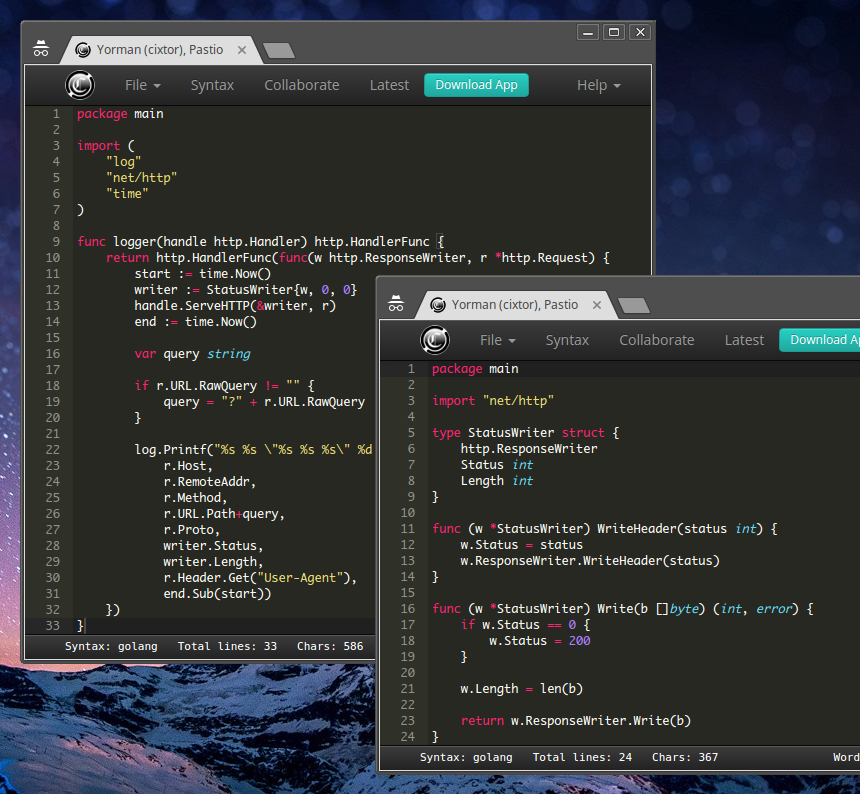

# Pastio

[Pastio](http://cixtor.com/pastio) is a multi-platform desktop application built on top of [node-webkit](https://github.com/rogerwang/node-webkit), [node.js](http://nodejs.org/) and a public web-service maintained by [Cixtor](http://cixtor.com/) to paste, collaborate and visualize `text/plain` files like source code, markdown files, plain text documents and publish them public or privately for an unlimited time and share those files using a unique link identifier.



### Features

* Web and Desktop application.
* Download, view raw and print.
* Inline code editor powered by [Ace Editor](https://github.com/ajaxorg/ace).
* More than 100 modes for syntax.
* Collaborative mode powered by [TogetherJS](https://togetherjs.com/).
* Text chat powered by [Web RTC](http://www.webrtc.org/).
* Audio chat with familiar instant messaging.
* User mouse focus indicator.
* Real time content syncronization.

### License

```text
Copyright (c) 2013, CIXTOR
All rights reserved.

Redistribution and use in source and binary forms, with or without modification,
are permitted provided that the following conditions are met:

Redistributions of source code must retain the above copyright notice, this list
of conditions and the following disclaimer.
Redistributions in binary form must reproduce the above copyright notice, this
list of conditions and the following disclaimer in the documentation and/or other
materials provided with the distribution.
Neither the name of the CIXTOR PASTIO nor the names of its contributors may be
used to endorse or promote products derived from this software without specific
prior written permission.
THIS SOFTWARE IS PROVIDED BY THE COPYRIGHT HOLDERS AND CONTRIBUTORS "AS IS" AND
ANY EXPRESS OR IMPLIED WARRANTIES, INCLUDING, BUT NOT LIMITED TO, THE IMPLIED
WARRANTIES OF MERCHANTABILITY AND FITNESS FOR A PARTICULAR PURPOSE ARE DISCLAIMED.
IN NO EVENT SHALL THE COPYRIGHT HOLDER OR CONTRIBUTORS BE LIABLE FOR ANY DIRECT,
INDIRECT, INCIDENTAL, SPECIAL, EXEMPLARY, OR CONSEQUENTIAL DAMAGES (INCLUDING,
BUT NOT LIMITED TO, PROCUREMENT OF SUBSTITUTE GOODS OR SERVICES; LOSS OF USE,
DATA, OR PROFITS; OR BUSINESS INTERRUPTION) HOWEVER CAUSED AND ON ANY THEORY OF
LIABILITY, WHETHER IN CONTRACT, STRICT LIABILITY, OR TORT (INCLUDING NEGLIGENCE
OR OTHERWISE) ARISING IN ANY WAY OUT OF THE USE OF THIS SOFTWARE, EVEN IF ADVISED
OF THE POSSIBILITY OF SUCH DAMAGE.
```